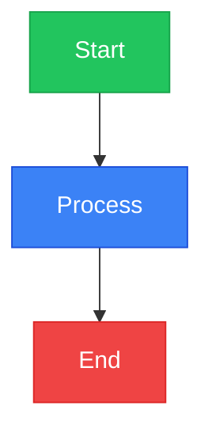
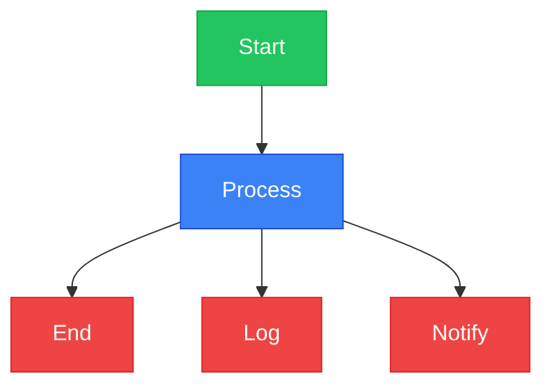
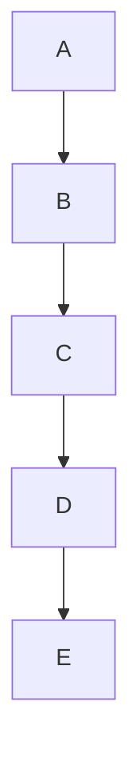
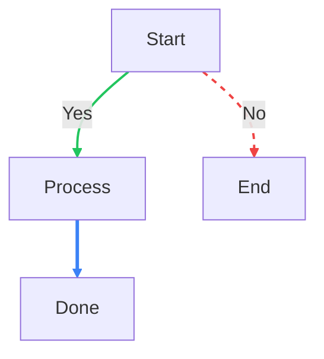
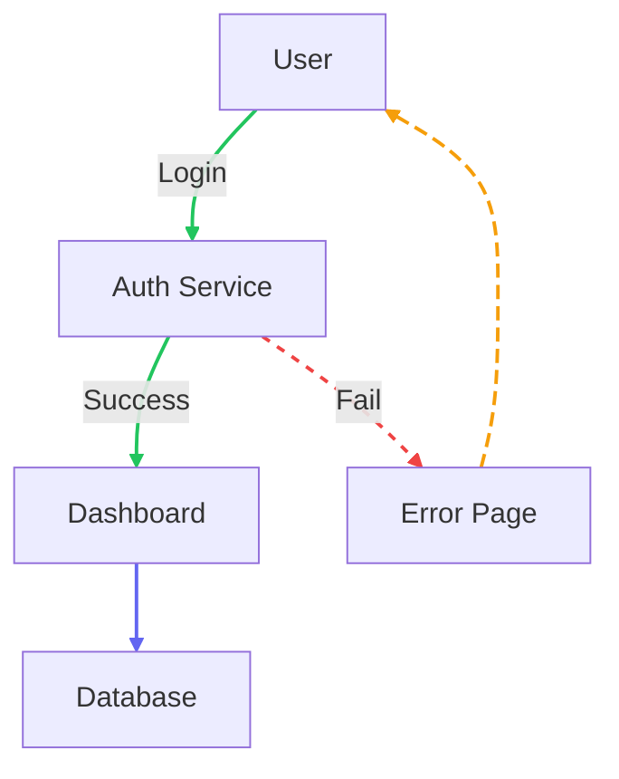
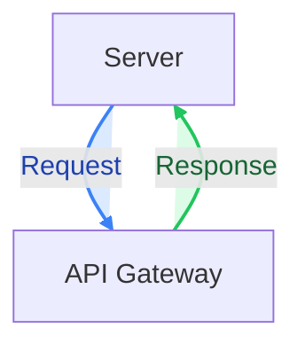
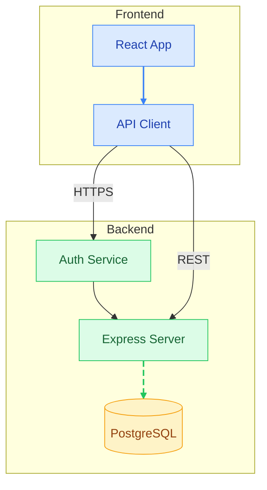

# Mermaid Diagram Styling Guide

This guide explains all the syntax you can use to apply colors and styles to nodes and edges in Mermaid diagrams.

---

## 1. Node Styling

There are **3 ways** to style nodes, from simplest to most powerful.

### 1a. Inline `style` (per-node)

Apply styles directly to a single node by its ID.

**Syntax:**
```
style <nodeId> <property>:<value>,<property>:<value>
```

**Available properties:**
| Property | Example Value | Description |
|---|---|---|
| `fill` | `#3b82f6` | Background color |
| `stroke` | `#1e40af` | Border color |
| `stroke-width` | `2px` | Border thickness |
| `color` | `#ffffff` | Text color |
| `font-size` | `14px` | Text size |
| `font-weight` | `bold` | Text weight |
| `rx` | `8` | Corner roundness (horizontal) |
| `ry` | `8` | Corner roundness (vertical) |
| `opacity` | `0.8` | Transparency (0-1) |

**Example:**


---

### 1b. `classDef` + `class` (reusable styles)

Define a style class once, then apply it to multiple nodes.

**Syntax:**
```
classDef <className> <property>:<value>,<property>:<value>
class <node1>,<node2> <className>
```

**Example:**


---

### 1c. Theme CSS (global overrides)

Override default styles for ALL nodes of a type using raw CSS.

**Example:**
```css
/* All rectangular nodes */
.node rect {
  fill: #f0f9ff;
  stroke: #3b82f6;
  stroke-width: 2px;
  rx: 8;
  ry: 8;
}

/* All diamond nodes */
.node polygon {
  fill: #fef3c7;
  stroke: #f59e0b;
}

/* All circular nodes */
.node circle {
  fill: #ede9fe;
  stroke: #8b5cf6;
}

/* All text inside nodes */
.node text {
  font-size: 12px;
  font-weight: bold;
}

/* Edge paths */
.edgePath .path {
  stroke: #6366f1;
  stroke-width: 2px;
}

/* Edge labels */
.edgeLabel {
  background-color: #f8fafc;
  font-size: 11px;
}
```

---

## 2. Edge Styling (lines between nodes)

Edges can ONLY be styled in **flowchart** diagrams using `linkStyle`.

**Syntax:**
```
linkStyle <edgeIndex> <property>:<value>,<property>:<value>
```

The `edgeIndex` starts at **0** and counts edges in order of appearance in the code.

**Available properties for edges:**
| Property | Example Value | Description |
|---|---|---|
| `stroke` | `#3b82f6` | Line color |
| `stroke-width` | `2px` | Line thickness |
| `stroke-dasharray` | `8 4` | Dash pattern |
| `color` | `#1e293b` | Label text color |
| `fill` | `#ffffff` | Label background color |
| `opacity` | `0.5` | Transparency (0-1) |

**Dash patterns:**
| Pattern | Value | Visual |
|---|---|---|
| Solid | (empty) | `─────────` |
| Dashed | `8 4` | `──── ────` |
| Short dash | `5 5` | `─── ───` |
| Dotted | `3 3` | `─ ─ ─ ─` |
| Tiny | `2 2` | `─ ─ ─ ─` (tight) |
| Dash-dot | `8 4 2 4` | `──── ─·──` |
| Custom | `10 5 2 5` | any pattern |

---

### Edge Index Counting

Edge indices are counted in order of appearance, including **chained edges**:



This produces **4 edges**:
| Index | From | To |
|---|---|---|
| 0 | A | B |
| 1 | B | C |
| 2 | C | D |
| 3 | D | E |

---

### Examples

**Colored edges with labels:**


**Mixed edge styles:**


**Edge label coloring:**


---

## 3. Full Example (combining everything)



---

## 4. Quick Reference

| Element | Syntax | Where |
|---|---|---|
| Color a node | `style A fill:#color` | Any diagram |
| Reusable style | `classDef name fill:#color` + `class A name` | Any diagram |
| Color an edge | `linkStyle 0 stroke:#color` | Flowchart only |
| Edge dash | `linkStyle 0 stroke-dasharray: 8 4` | Flowchart only |
| Edge label color | `linkStyle 0 color:#color` | Flowchart only |
| Edge label bg | `linkStyle 0 fill:#color` | Flowchart only |
| Global node style | `.node rect { fill: #color; }` | Theme CSS |
| Global edge style | `.edgePath .path { stroke: #color; }` | Theme CSS |
