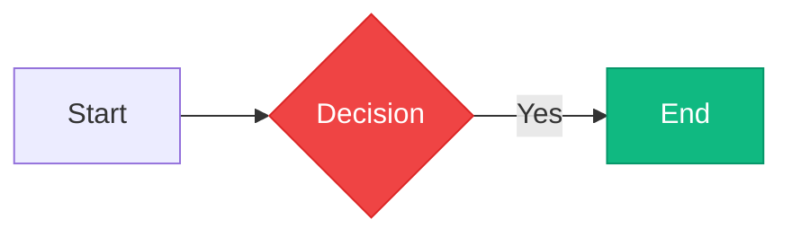
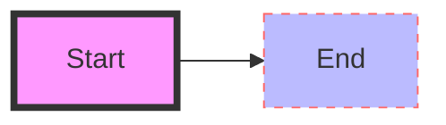

# Deep Research: Rich Custom Styling for Mermaid Editor

## Current Limitation

The editor currently applies styles **globally** via `themeVariables` (5 colors: `primaryColor`, `secondaryColor`, `lineColor`, `primaryBorderColor`, `primaryTextColor`). Every node of the same type gets the same look. There is no way to make Node A red and Node B green individually.

---

## What Mermaid Actually Supports (Not Yet Exposed)

Mermaid has **4 layers** of styling. The editor currently only uses Layer 4.

### Layer 1: `classDef` + `class` (Recommended)

Define a named style class once, apply to any node/edge.



**Supported CSS Properties:**

| Property | Effect | Example |
|---|---|---|
| `fill` | Background color | `fill:#ff6b6b` |
| `stroke` | Border color | `stroke:#333` |
| `stroke-width` | Border thickness | `stroke-width:3px` |
| `stroke-dasharray` | Dashed border | `stroke-dasharray: 5 5` |
| `color` | Text color | `color:#fff` |
| `font-size` | Text size | `font-size:14px` |
| `font-weight` | Bold/normal | `font-weight:bold` |
| `font-style` | Italic | `font-style:italic` |
| `rx` | Horizontal corner radius | `rx:8` |
| `ry` | Vertical corner radius | `ry:8` |
| `opacity` | Transparency | `opacity:0.8` |

### Layer 2: Inline `style` (One-off Styling)

Apply CSS directly to a specific node by ID.



Same properties as `classDef`. Does not scale -- use `classDef` when multiple nodes need the same treatment.

### Layer 3: `themeCSS` (Arbitrary CSS)

Injects raw CSS into the SVG's scoped `<style>` tag. Supports pseudo-classes, animations, filters, shadows.

```yaml
---
config:
  theme: base
  themeCSS: |
    .node rect { rx: 8; ry: 8; filter: drop-shadow(0 2px 4px rgba(0,0,0,0.1)); }
    .edgePath path { stroke-width: 2.5px; }
---
```

Uses `!important` internally so it overrides theme defaults. This is the most powerful layer.

### Layer 4: `themeVariables` (Global Theme -- What Exists Now)

```yaml
config:
  theme: base
  themeVariables:
    primaryColor: "#f0f4ff"
    primaryTextColor: "#1e1b4b"
```

Only works with `theme: base`. Controls diagram-wide defaults. **This is the only layer the editor currently exposes.**

---

## Per-Diagram-Type Support

| Diagram Type | `style` | `classDef` | `class` | Notes |
|---|---|---|---|---|
| Flowchart | ✅ | ✅ | ✅ | Full support |
| Class Diagram | ✅ | ✅ | ✅ | Full support |
| State Diagram | ✅ | ✅ | ✅ | Full support |
| ER Diagram | ✅ | ✅ | ✅ | Full support |
| Sequence | ✅ | ✅ | ✅ | Actors only (PR #7542, most upvoted feature) |
| Mindmap | Limited | Limited | Limited | Node styling varies |
| Gantt | ❌ | ❌ | ❌ | Section-based only |
| Pie | ❌ | ❌ | ❌ | N/A |
| Timeline | Limited | Limited | Limited | Per-era styling possible |

---

## Post-Render SVG Manipulation

After `mermaid.render()` returns SVG string, we can:

1. **Parse the SVG** with `DOMParser`
2. **Find elements** by `data-id` attribute (Mermaid adds these to nodes)
3. **Add click handlers** for selection
4. **Apply visual highlights** (blue border, glow effect) on selection
5. **Inject style classes** dynamically

Mermaid's SVG structure for a node:

```xml
<g class="node default" data-id="nodeA" id="flowchart-A">
  <rect rx="5" ry="5" width="100" height="40" fill="#fff4dd" stroke="#d4a017"/>
  <g class="label">
    <foreignObject>
      <div><span>Node Label</span></div>
    </foreignObject>
  </g>
</g>
```

Edge structure:

```xml
<g class="edgePath" data-id="edge-AB">
  <path class="flowchart-link" d="M..." stroke="#333" fill="none"/>
  <g class="edgeLabel">
    <foreignObject><div><span>Yes</span></div></foreignObject>
  </g>
  <marker id="arrowhead">
    <path d="M..." fill="#333"/>
  </marker>
</g>
```

---

## Architecture for Implementation

### 3-Tier Styling System

#### Tier 1: Per-Element Visual Style Editor

- Click-to-select nodes/edges in the rendered SVG preview
- Style Panel appears showing properties for the selected element
- Color pickers for fill, stroke, text color
- Sliders for stroke-width, opacity, corner radius
- Writes back to Mermaid code as `style` statements
- Multi-select support (Shift+Click)

#### Tier 2: Style Class Manager

- Reusable style presets (e.g., "Success", "Danger", "Warning", "Info")
- Custom class creator -- name a class, set properties, save it
- Bulk apply -- select multiple nodes, apply the same class
- Default class -- `classDef default` for baseline styling
- Preset library with 10+ built-in styles

#### Tier 3: ThemeCSS Power User Mode

- Raw CSS editor for advanced users
- Preset templates (glassmorphism, neon, hand-drawn, flat, etc.)
- Hover effects, animations, gradients, shadows

---

## What Mermaid Studio (IntelliJ Plugin) Does

For reference, Mermaid Studio has:

- **Visual Editing** -- click nodes in preview, drag to move, edit labels inline
- **Style Pane** -- property inspector with color pickers, shape selector, presets
- **Writes back** `classDef` + `class` to source automatically
- **Preset gallery** -- reusable style templates
- Selection stays pinned through editor focus changes
- Renaming follows through to pane header and preview highlight

---

## Implementation Plan

### Phase 1: SVG Click-to-Select + Style Panel

1. Parse rendered SVG, find all `g[data-id]` elements
2. Add click handlers for selection
3. Visual selection highlight (blue border + glow)
4. Style panel UI: color pickers, sliders
5. Generate `style` statements in code on change
6. Parse existing `style`/`classDef` from code to populate panel

### Phase 2: Style Class Manager

1. Named style classes with persistence (Zustand + localStorage)
2. Preset library (10+ built-in styles)
3. Bulk multi-select and apply
4. Class assignment UI (`class A myStyle`)
5. Default class support

### Phase 3: ThemeCSS Editor

1. Raw CSS editor with syntax highlighting
2. Preset CSS templates (glassmorphism, neon, etc.)
3. Live preview of CSS changes
4. Inject via `themeCSS` config

### Phase 4: Per-Element Properties

1. Edge styling (line color, width, dash pattern, animation)
2. Label styling (font, size, color, alignment)
3. `linkStyle` support for edges

---

## Key Technical Decisions

1. **Use `style` for one-off, `classDef`+`class` for reusable** -- matches Mermaid's design
2. **Post-render SVG manipulation for selection** -- `data-id` attribute lookup, click handlers, visual highlights
3. **Re-render on code change** -- when user modifies `classDef`/`style` in code editor, preview updates automatically
4. **Store style presets in Zustand** -- alongside existing theme colors
5. **Per-diagram style classes** -- each diagram type maintains its own set of saved classes
6. **Parse existing styles from code** -- when user clicks a node, parse its current `style`/`classDef` to populate the panel

---

## Files to Create/Modify

| File | Action | Purpose |
|---|---|---|
| `src/components/StyleEditor.jsx` | **Create** | Main style editing panel with color pickers, sliders |
| `src/components/ElementSelector.jsx` | **Create** | SVG click-to-select logic and selection highlight |
| `src/components/StylePresets.jsx` | **Create** | Preset style library UI |
| `src/components/ClassManager.jsx` | **Create** | classDef/class management UI |
| `src/components/ThemeCSSEditor.jsx` | **Create** | Raw CSS editor for themeCSS |
| `src/store/editorStore.js` | **Modify** | Add style state: selectedElement, styleClasses, styleOverrides, themeCSS |
| `src/components/Preview.jsx` | **Modify** | Add post-render SVG manipulation, click handlers, selection highlight |
| `src/utils/styleParser.js` | **Create** | Parse/generate `style`/`classDef`/`class` Mermaid syntax |
| `src/utils/svgInspector.js` | **Create** | Parse rendered SVG, find elements by data-id, apply highlights |
| `src/data/stylePresets.js` | **Create** | Built-in style preset definitions |
